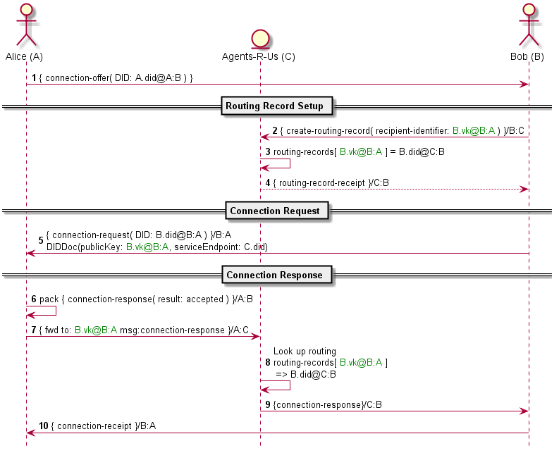
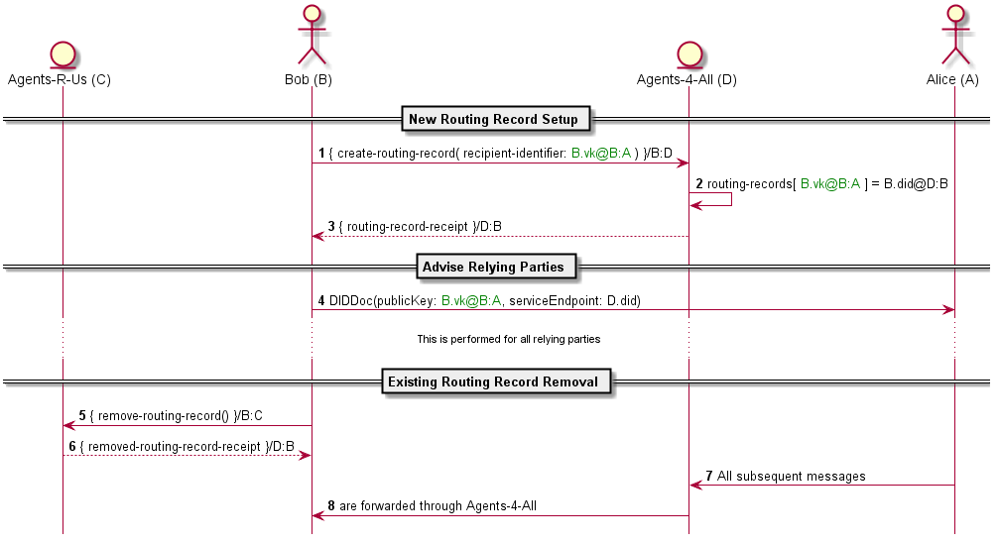

- Name: agent-message-routing
- Author: Tobias Looker & Daniel Zollinger
- Start Date: 2018-11-22
- PR: (leave this empty)
- Jira Issue: (leave this empty)

# Summary
[summary]: #summary

Defines the message types required to administer routing records, which are required to enable delivery of A2A messages in complex agent domains. Describes how A2A message routing is accomplished in the presence of these routing records.

# Motivation
[motivation]: #motivation

Routing records will underpin the ability to successfully deliver an agent message through a complicated domain, it is therefore important that the administration of these records is well understood and standardised.

[Cross domain messaging](https://github.com/hyperledger/indy-hipe/tree/master/text/0022-cross-domain-messaging) introduced the forward message type and this HIPE intends to define the message types required for an agent to maintain the routing records to which the forward message type depends.

# Tutorial

## New Connection Example

Bob and Alice want to connect so they can exchange messages.

**Connection Offer** (Steps 1 on UML diagram below)

Alice's Agent sends Bob's Agent an out-of-band connection invitation of the following form.

```json
{
  "@type": "did:sov:BzCbsNYhMrjHiqZDTUASHg;spec/connections/1.0/invitation",
  "label" : "Alice",
  "recipientKeys": ["8HH5gYEeNc3z7PYXmd54d4x6qAfCNrqQqEB3nS7Zfu7K"],
  "serviceEndpoint": "https://example.com/endpoint"
}
```

In this case Alice's Agent is directly contactable by Bob's Agent with no additional routing required. Bob's Agent, however, elects to receive messages through a mediator, Agents-r-us.


Bob decides to accept the connection invitation and intends to send Alice's Agent a connection request. Some setup is required to establish the return delivery path before this can be done.

Bob first generates the following pairwise DID and corresponding verkey that he will disclose to Alice.

`B.did@B:A`  Pairwise DID to be disclosed to Alice by Bob

`B.verkey@B:A`  Verification key to be disclosed to Alice by Bob

**Routing Record Setup** (Steps 2-4 on UML diagram below)

In order for a message to successfully reach Bob from Alice via the elected mediator (Agents-r-us), Bob's Agent must now connect with Agents-r-us and create a routing record to establish the delivery path back to his agent.

Note - for this example it is assumed that Agents-r-us and Bob's Agent have connected previously and have the following pairwise DIDs denoting their relationship (DIDDocs for these DIDs would have been exchanged via the connection protocol).

`B.did@B:C` Pairwise DID disclosed by Bob to Agents-r-us

`C.did@C:B` Pairwise DID disclosed by Agents-r-us to Bob

`C.verkey@C:B` Verification key disclosed by Agents-r-us to Bob

`C.endpoint@C:B` Service endpoint employed by Agents-r-us

In the presence of this connection, Bob's Agent prepares the following message for Agents-r-us:

```json
{
  "@type": "did:sov:BzCbsNYhMrjHiqZDTUASHg;spec/routing/1.0/route-update-request",
	"@id": "uuid:1",
  "updates": [
    {
      "recipient_key": "<B.verkey@B:A>",
      "action": "create"
    }
  ]
}
```

Note - Agents-r-us MUST be able to associate the incoming message with an existing pairwise connection, as this determines how incoming messages are forwarded to Bob. This association is determined by the sender verkey used to encrypt the wire message.

Agents-r-us receives this message and adds a new routing record, associating the provided recipient key with the current pairwise connection. It sends back a summary of the changes so that Bob's Agent can verify that the record was added:

```json
{
  "@type": "did:sov:BzCbsNYhMrjHiqZDTUASHg;spec/routing/1.0/route-update-response",
  "@id": "uuid:2",
  "~thread": {
    "thid": "uuid:1"
  },
  "updated": [
    {
      "recipient_key": "<B.verkey@B:A>",
      "action": "create",
      "result": "success"
    }
  ]
}
```

**Connection Request** (Step 5 on UML diagram below)

Once Bob's Agent has received the routing update confirmation, Bob sends the following connection request to Alice:

```json
{
  "@type": "did:sov:BzCbsNYhMrjHiqZDTUASHg;spec/connections/1.0/request",
  "@id": "uuid:3",
  "label": "Bob",
  "connection": {
    "did": "<B.did@B:A>",
    "did_doc": {
      "@context": "https://w3id.org/did/v1",
      "id": "<B.did@B:A>",
      "publicKey": [
          {
            "id": "1",
            "type": "RsaVerificationKey2018",
            "controller": "<B.did@B:A>",
            "publicKeyBase58": "<B.verkey@B:A>"
          }
      ],
      "authentication": [
        {
          "type": "RsaSignatureAuthentication2018",
          "publicKey": "<B.verkey@B:A>"
        }
      ],
      "service": [
        {
          "id": "indy",
          "type": "Agency",
          "recipientKeys": ["<B.verkey@B:A>"],
          "routingKeys": ["C.verkey@C:B"],
          "serviceEndpoint": "<C.endpoint>"
        }
      ]
    }
  }
}
```


**Connection Response** (Steps 6-10 on UML diagram below)

Now Alice has received the connection request from Bob along with the DIDDoc Bob's Agent generated for this connection. Alice prepares the following connection response message for Bob to complete the connection process:

```json
{
  "@type": "did:sov:BzCbsNYhMrjHiqZDTUASHg;spec/connections/1.0/response",
  "@id": "uuid:4",
  "~thread": {
    "thid": "uuid:3"
  },
  "connection": {
    "did": "<A.did@A:B>",
    "did_doc": {
      "@context": "https://w3id.org/did/v1",
      "id": "<A.did@A:B>",
      "publicKey": [
          {
            "id": "1",
            "type": "RsaVerificationKey2018",
            "controller": "<A.did@A:B>",
            "publicKeyBase58": "<A.verkey@A:B>"
          }
      ],
      "authentication": [
        {
          "type": "RsaSignatureAuthentication2018",
          "publicKey": "<A.verkey@A:B>"
        }
      ],
      "service": [
        {
          "id": "indy",
          "type": "Agency",
          "recipientKeys": ["A.verkey@A:B"],
          "routingKeys": [],
          "serviceEndpoint": "https://example.com/endpoint"
        }
      ]
    }
  }
}
```

Alice's Agent now takes the above message and packs it into a wire message for Bob. Because Bob's DIDDoc lists a routing key, Alice's Agent must wrap the wire message in an additional Forward message with the `to` property set to the Bob's recipient key:

```json
{
  "@type": "did:sov:BzCbsNYhMrjHiqZDTUASHg;spec/routing/1.0/forward",
  "to": "<B.verkey@B:A>",
  "msg": "<packed-msg>"
}
```

This Forward message is packed using the routing key, so that it can only be unpacked by Agents-r-us. No sender verification key is provided (the message is anon-encrypted), and Agents-r-us SHOULD NOT be able to recover the sender, as this is an unnecessary disclosure of information. The message is delivered to the endpoint Bob listed in the DIDDoc provided to Alice, which is the public endpoint of Agents-r-us.

Upon receiving and unpacking the Forward message, Agents-r-us searches its routing records for the recipient key contained in the `to` field. It finds the recipient key is associated with the pairwise connection it has formed with Bob. Agents-r-us then looks up the details of the pairwise connection and its related contact information (contained in the DIDDoc Bob provided to Agents-r-us), then transmits the contents of the `msg` field to Bob's Agent, completing the message delivery.

**Sequence Diagram**

The below sequence diagram depicts the above example



## Change Agent Mediator Example

`Note - in order for this example to make the most sense it is advised that the previous example is read prior.`

Lets assume the following state, Bob and Alice are connected and the delivery path for messages from Alice to Bob take the following path.


Restated here for clarity is the pairwise Did Bob has disclosed to Alice when connecting.

`B.did@B:A`

However Bob has now decided that he no longer wants to use agents-r-us as the mediator for messages being delivered from Alice to him.

Instead he wants to use the new provider agents-4-all, the below diagram depicts what Bob ultimately wants to achieve.


**New Routing Record Setup** (steps 1,2 and 3 on the UML diagram below)

Prior to Bob updating the DIDDoc he has previously shared with Alice about how to deliver messages to him, there is some setup and transfer required.

In order for a message to successfully reach Bob from Alice via the newly elected mediator (agents-4-all), Bob must now connect with agents-4-all and create a routing record to establish the delivery path back to his agent. 

Note - for this example it is assumed that agents-4-all and Bobs agent have now connected and the following pairwise DID's denoting their relationship have been exchanged (DIDDocs for these DID's would also have been exchanged via microledgers).

`B.did@B:D` Pairwise DID disclosed by Bob to Agents-4-all

`D.did@D:B` Pairwise DID disclosed by Agents-4-all to Bob

With this connection Bob prepares the following message for agents-4-all.

```json
{
 "@type": "did:sov:BzCbsNYhMrjHiqZDTUASHg;spec/routing/0.1/create",
 "recipient-identifier" : "<B.did@B:A>"
}
```

Bobs agent then packs this message for agents-4-all

`pack(AgentMessage,valueOf(<D.did@D:B>), privKey(<B.vk@B:D>))`

Note - with this wire level message agents-4-all MUST be able to recover the sender. As this is the basis for the routing record.

On processing of this message agents-4-all creates the following routing record which is stored locally.

```json
{
 "recipient-identifier" : "<B.vk@B:A>",
 "DID" : "<B.did@B:D>"
}
```

**Advise relying parties** (steps 4 on the UML diagram below)

On confirmation from agents-4-all this routing record has been commited, Bob can now proceed with updating his DIDDoc (note likely to occur via microledgers) he has shared with Alice to use agents-4-all as the mediator. The final form of his new DIDDoc will take the following.

```json
{
  "@context": "https://w3id.org/did/v1",
  "id": "<B.did@B:A>",
  "publicKey": [
    {"id": "1", "type": "RsaVerificationKey2018",  "owner": "<B.did@B:A>","publicKeyBase58": "<B.vk@B:A>"}
  ],
  "authentication": [
    {"type": "RsaSignatureAuthentication2018", "publicKey": "<B.pk@B:A>"}
  ],
  "service": [
    {"type": "Agency", "serviceEndpoint": "<D.did>" }
  ]
}
```

**Existing Routing Record Removal** (steps 5-6 on the UML diagram below)

Now that Bob has established a new delivery path via agents-4-all and communicated this change to Alice, he can now remove routing records he once had with agents-4-us.

In order to remove this routing record, Bob's agent prepares the following message to agents-r-us.

```json
{
 "@type": "did:sov:BzCbsNYhMrjHiqZDTUASHg;spec/routing/0.1/delete",
 "recipient-identifier" : "<B.did@B:A>"
}
```

Note - with the wire level message used to transport the above, agents-r-us MUST be able to recover the sender. As this is how agents-4-us identifies the owner of the routing record.

Agents-4-us looks up its local routing records it has for Bob and finds the following and deletes it.

```json
{
 "recipient-identifier" : "<B.did@B:A>",
 "DID" : "<B.did@B:C>"
}
```

**Sequence Diagram**

The below sequence diagram depicts the above example



## Routing record definitions
The following A2A message type definitions are required for the maintenance of routing records

Create Routing Record Message

```json
{
 "@type": "did:sov:BzCbsNYhMrjHiqZDTUASHg;spec/routing/0.1/create",
 "recipient-identifier" : "<recipient-identifier>"
}
```

Delete Routing Record Message

```json
{
 "@type": "did:sov:BzCbsNYhMrjHiqZDTUASHg;spec/routing/0.1/delete",
 "recipient-identifier" : "<recipient-identifier>"
}
```

Get Routing Records Message

```json
{
 "@type": "did:sov:BzCbsNYhMrjHiqZDTUASHg;spec/routing/0.1/get"
}
```

Routing Records Message

```json
{
 "@type": "did:sov:BzCbsNYhMrjHiqZDTUASHg;spec/routing/0.1/routes",
 "recipient-identifiers" : ["<recipient-identifier>"]
}
```

Forward to multiple recipients

```json
{
  "@type" : "did:sov:BzCbsNYhMrjHiqZDTUASHg;spec/routing/1.0/forward-multiple",
  "to"   : [ "<B.1.did:A:B>", "<B.2.did:A:B>", "<B.3.did:A:B>" ],
  "msg"  : "<pack(AgentMessage,valueOf(<B.1.vk>), privKey(<A.1.sk@A:B>))>"
}
```

Note - the above message type is a variation on the `forward message type` that was proposed [here](https://github.com/hyperledger/indy-hipe/tree/master/text/0022-cross-domain-messaging)

# Reference

- [Cross Domain Messaging](https://github.com/hyperledger/indy-hipe/tree/master/text/0022-cross-domain-messaging)
- [Connection Protocol](https://github.com/hyperledger/indy-hipe/blob/2cd01124a6dc320d80821139d6fc042a842e9f24/text/connection-protocol/README.md)
- [Agent to Agent Communication Video](https://drive.google.com/file/d/1PHAy8dMefZG9JNg87Zi33SfKkZvUvXvx/view)
- [Agent to Agent Communication Presentation](https://docs.google.com/presentation/d/1H7KKccqYB-2l8iknnSlGt7T_sBPLb9rfTkL-waSCux0/edit#slide=id.p)

# Drawbacks

- Route spoofing is only prevented by the agent first creating routing records prior to disclosing connection information to another party.
- Suitability of A2A messaging protocol for administering routing records.
- Imposes the constrain that certain A2A messages must be authcrypt to recover the sender in order for them to be valid. 

# Rationale and alternatives

- A separate protocol for administering routing records.
- A challenge request response type pattern for authentication of the recipient identifier.
- Routing based on the pairwise verkey instead of the did, this potentially reduces the information disclosure to the intermediate agent and makes it far simplier to implement a challenge request response protocol, but increases complexity around key rotation?

# Unresolved questions

- Assumptions about the role microledgers would play have been made.
