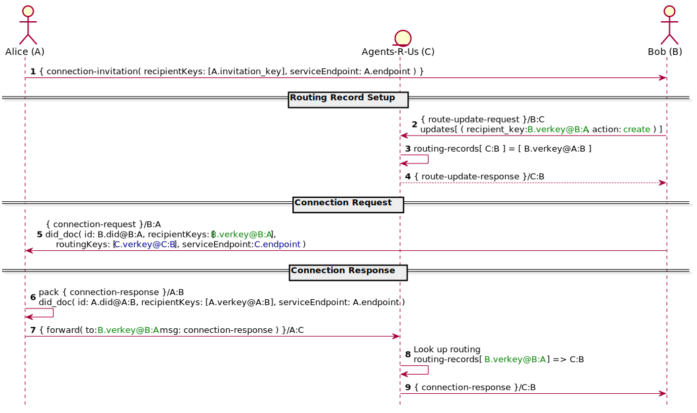
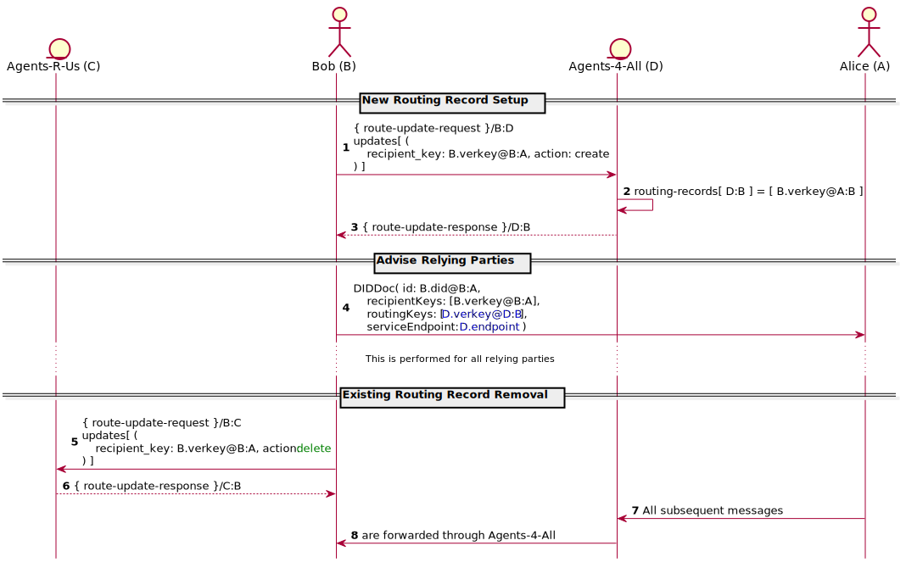

- Name: agent-message-routing
- Author: Tobias Looker & Daniel Zollinger
- Start Date: 2018-11-22
- PR: (leave this empty)
- Jira Issue: (leave this empty)

# Summary
[summary]: #summary

Defines the message types required to administer routing records, which are required to enable delivery of A2A messages in complex agent domains. Describes how A2A message routing is accomplished in the presence of these routing records.

# Motivation
[motivation]: #motivation

Routing records will underpin the ability to successfully deliver an agent message through a complicated domain, it is therefore important that the administration of these records is well understood and standardised.

[Cross domain messaging](https://github.com/hyperledger/indy-hipe/tree/master/text/0022-cross-domain-messaging) introduced the forward message type and this HIPE intends to define the message types required for an agent to maintain the routing records to which the forward message type depends.

# Tutorial

## New Connection Example

Bob and Alice want to connect so they can exchange messages.

**Connection Offer** (Steps 1 on UML diagram below)

Alice's Agent sends Bob's Agent an out-of-band connection invitation of the following form.

```json
{
  "@type": "did:sov:BzCbsNYhMrjHiqZDTUASHg;spec/connections/1.0/invitation",
  "label" : "Alice",
  "recipientKeys": ["<A.invitation_key>"],
  "routingKeys": [],
  "serviceEndpoint": "<A.endpoint>"
}
```

In this case Alice's Agent is directly contactable by Bob's Agent with no additional routing required. Bob's Agent, however, elects to receive messages through a mediator, Agents-R-Us.


Bob decides to accept the connection invitation and intends to send Alice's Agent a connection request. Some setup is required to establish the return delivery path before this can be done.

Bob first generates the following pairwise DID and corresponding verkey that he will disclose to Alice:

| Identifier | Meaning |
| --- | --- |
| `B.did@B:A` | Pairwise DID to be disclosed to Alice by Bob |
| `B.verkey@B:A` | Verification key to be disclosed to Alice by Bob |

**Routing Record Setup** (Steps 2-4 on UML diagram below)

In order for a message to successfully reach Bob from Alice via the elected mediator (Agents-R-Us), Bob's Agent must now connect with Agents-R-Us and create a routing record to establish the delivery path back to his agent.

Note - for this example it is assumed that Agents-R-Us and Bob's Agent have connected previously and have the following pairwise DIDs denoting their relationship (DIDDocs for these DIDs would have been exchanged via the connection protocol).

| Identifier | Meaning |
| --- | --- |
| `B.did@B:C` | Pairwise DID disclosed by Bob to Agents-R-Us |
| `B.verkey@B:C` | Verification key disclosed by Bob to Agents-R-Us |
| `C.did@C:B` | Pairwise DID disclosed by Agents-R-Us to Bob |
| `C.verkey@C:B` | Verification key disclosed by Agents-R-Us to Bob |
| `C.endpoint` | Service endpoint employed by Agents-R-Us |

In the presence of this connection, Bob's Agent prepares the following message for Agents-R-Us:

```json
{
  "@type": "did:sov:BzCbsNYhMrjHiqZDTUASHg;spec/routing/1.0/route-update-request",
  "@id": "uuid:1",
  "updates": [
    {
      "recipient_key": "<B.verkey@B:A>",
      "action": "create"
    }
  ]
}
```

Note - Agents-R-Us MUST be able to associate the incoming message with an existing pairwise connection, as this determines how incoming messages are forwarded to Bob. This association is determined by the sender verkey used to encrypt the wire message.

Agents-R-Us receives this message and adds a new routing record, associating the provided recipient key with the current pairwise connection. It sends back a summary of the changes so that Bob's Agent can verify that the record was added:

```json
{
  "@type": "did:sov:BzCbsNYhMrjHiqZDTUASHg;spec/routing/1.0/route-update-response",
  "@id": "uuid:2",
  "~thread": {
    "thid": "uuid:1"
  },
  "updated": [
    {
      "recipient_key": "<B.verkey@B:A>",
      "action": "create",
      "result": "success"
    }
  ]
}
```

**Connection Request** (Step 5 on UML diagram below)

Once Bob's Agent has received the routing update confirmation, Bob sends the following connection request to Alice:

```json
{
  "@type": "did:sov:BzCbsNYhMrjHiqZDTUASHg;spec/connections/1.0/request",
  "@id": "uuid:3",
  "label": "Bob",
  "connection": {
    "did": "<B.did@B:A>",
    "did_doc": {
      "@context": "https://w3id.org/did/v1",
      "id": "<B.did@B:A>",
      "publicKey": [
        {
          "id": "1",
          "type": "RsaVerificationKey2018",
          "controller": "<B.did@B:A>",
          "publicKeyBase58": "<B.verkey@B:A>"
        }
      ],
      "service": [
        {
          "id": "indy",
          "type": "Agency",
          "recipientKeys": ["<B.verkey@B:A>"],
          "routingKeys": ["<C.verkey@C:B>"],
          "serviceEndpoint": "<C.endpoint>"
        }
      ]
    }
  }
}
```


**Connection Response** (Steps 6-10 on UML diagram below)

Now Alice has received the connection request from Bob along with the DIDDoc Bob's Agent generated for this connection. Alice prepares the following connection response message for Bob to complete the connection process:

```json
{
  "@type": "did:sov:BzCbsNYhMrjHiqZDTUASHg;spec/connections/1.0/response",
  "@id": "uuid:4",
  "~thread": {
    "thid": "uuid:3"
  },
  "connection": {
    "did": "<A.did@A:B>",
    "did_doc": {
      "@context": "https://w3id.org/did/v1",
      "id": "<A.did@A:B>",
      "publicKey": [
        {
          "id": "1",
          "type": "RsaVerificationKey2018",
          "controller": "<A.did@A:B>",
          "publicKeyBase58": "<A.verkey@A:B>"
        }
      ],
      "service": [
        {
          "id": "indy",
          "type": "Agency",
          "recipientKeys": ["<A.verkey@A:B>"],
          "routingKeys": [],
          "serviceEndpoint": "<A.endpoint>"
        }
      ]
    }
  }
}
```

Alice's Agent now takes the above message and packs it into a wire message for Bob. Because Bob's DIDDoc lists a routing key, Alice's Agent must wrap the wire message in an additional `forward` message with the `to` property set to the Bob's recipient key:

```json
{
  "@type": "did:sov:BzCbsNYhMrjHiqZDTUASHg;spec/routing/1.0/forward",
  "to": "<B.verkey@B:A>",
  "msg": "<packed-msg>"
}
```

This `forward` message is packed using the routing key so that it can only be unpacked by Agents-R-Us. No sender verification key is provided (the message is anonymously encrypted). Agents-R-Us SHOULD NOT be able to recover the sender as this is an unnecessary disclosure of information. The message is delivered to the endpoint Bob listed in the DIDDoc provided to Alice, which is the public endpoint of Agents-R-Us (`C.endpoint`).

Upon receiving and unpacking the `forward` message, Agents-R-Us searches its routing records for the recipient key contained in the `to` field. It finds the recipient key is associated with the pairwise connection it has formed with Bob. Agents-R-Us then looks up the details of the pairwise connection and its related contact information (contained in the DIDDoc Bob provided to Agents-R-Us), then transmits the contents of the `msg` field to Bob's Agent, completing the message delivery.

**Sequence Diagram**

The below sequence diagram depicts the above example



## Change Agent Mediator Example

`Note - in order for this example to make the most sense it is advised that the previous example be read prior.`

Let's assume the following state, where Bob's Agent and Alice's Agent are connected and the delivery path for messages from Alice to Bob takes the following form.


Restated here for clarity is the pairwise DID Bob has disclosed to Alice when connecting:

| Identifier | Meaning |
| --- | --- |
| `B.did@B:A` | Pairwise DID disclosed to Alice by Bob |

In this example, Bob has now decided that he no longer wants to use Agents-R-Us as the mediator for messages being delivered from Alice to him. Instead he wants to use a new provider, Agents-4-All. The below diagram depicts the routing scenario that Bob ultimately wants to achieve:


**New Routing Record Setup** (steps 1, 2 and 3 on the UML diagram below)

Prior to Bob updating the DIDDoc he has previously shared with Alice describing how to deliver messages to him, there is some setup required to enable the correct routing of future messages.

In order for a message to successfully reach Bob from Alice via the newly elected mediator (Agents-4-All), Bob must now connect with Agents-4-All and create a routing record to establish the delivery path back to his agent. 

Note - for this example it is assumed that Agents-4-All and Bob's Agent have established a pairwise connection and the following pairwise DIDs denoting their relationship have been exchanged (DIDDocs for these DIDs would also have been exchanged via the connection protocol).

| Identifier | Meaning |
| --- | --- |
| `B.did@B:D` | Pairwise DID disclosed by Bob to Agents-4-All |
| `B.verkey@B:D` | Verification key disclosed by Bob to Agents-4-All |
| `D.did@D:B` | Pairwise DID disclosed by Agents-4-All to Bob |
| `D.verkey@D:B` | Verification key disclosed by Agents-4-All to Bob |
| `D.endpoint` | Service endpoint employed by Agents-4-All |

Making use of this pairwise connection, Bob prepares the following message for Agents-4-All:

```json
{
  "@type": "did:sov:BzCbsNYhMrjHiqZDTUASHg;spec/routing/1.0/route-update-request",
  "@id": "uuid:5",
  "updates": [
    {
      "recipient_key": "<B.verkey@B:A>",
      "action": "create"
    }
  ]
}
```

Bob's Agent then packs this message for Agents-4-All:

`pack(AgentMessage,valueOf(<D.verkey@D:B>), privKey(<B.verkey@B:D>))`

Note - Agents-4-All MUST be able to associate the incoming message with an existing pairwise connection, as this determines how incoming messages are forwarded to Bob. This association is determined by the sender verkey used to encrypt the wire message.

Upon processing of this message Agents-4-All creates a new internal routing record linking the recipient key provided by Bob to the pairwise connection between Bob's Agent and Agents-4-All.


**Advise Relying Parties** (steps 4 on the UML diagram below)

On confirmation from Agents-4-All that this routing record update has been committed, Bob can now proceed with updating the DIDDoc he has shared with Alice to use Agents-4-All as the mediator. The final form of his new DIDDoc will resemble the following:

```json
{
  "@context": "https://w3id.org/did/v1",
  "id": "<B.did@B:A>",
  "publicKey": [
    {
      "id": "1",
      "type": "RsaVerificationKey2018",
      "controller": "<B.did@B:A>",
      "publicKeyBase58": "<B.verkey@B:A>"
    }
  ],
  "service": [
    {
      "id": "indy",
      "type": "Agency",
      "recipientKeys": ["<B.verkey@B:A>"],
      "routingKeys": ["D.verkey@D:B"],
      "serviceEndpoint": "<D.endpoint>"
    }
  ]
}
```

**Existing Routing Record Removal** (steps 5-6 on the UML diagram below)

Now that Bob has established a new delivery path via Agents-4-All and communicated this change to Alice, he can remove the routing record he once had with Agents-R-Us.

In order to remove this routing record, Bob's Agent prepares and sends the following message to Agents-R-Us:

```json
{
  "@type": "did:sov:BzCbsNYhMrjHiqZDTUASHg;spec/routing/1.0/route-update-request",
  "@id": "uuid:6",
  "updates": [
    {
      "recipient_key": "<B.verkey@B:A>",
      "action": "delete"
    }
  ]
}
```

Note - As with previous interactions, Agents-R-Us MUST be able to associate the incoming message with an existing pairwise connection, as this determines how incoming messages are forwarded to Bob. This association is determined by the sender verkey used to encrypt the wire message.

Agents-R-Us looks up its local routing records and removes the recipient key `B.verkey@B:A`, meaning that any future `forward` messages received for that key will not have their payload forwarded to Bob. At this point Bob may choose to discard his pairwise connection with Agents-R-Us.


**Sequence Diagram**

The below sequence diagram depicts the above example



## Routing Record Definitions
The following A2A message type definitions are required for the maintenance of routing records


**Route Query Request**

Query the list of defined routes from a routing agent.

```json
{
  "@type": "did:sov:BzCbsNYhMrjHiqZDTUASHg;spec/routing/1.0/route-query-request",
  "filter": {
    "recipient_key": ["<recipient-key>"]
  },
  "paginate": {
    "limit": 100,
    "offset": 0
  }
}
```

The `filter` property (optional) is a dictionary containing lists of allowed values.
The only filter currently supported is `recipient_key`.

The `paginate` property (optional) is a dictionary with optional `offset` and `limit`
values, defining the first index and maximum number of items to return, respectively. The
routing agent may return fewer than `limit` records at its discretion.


**Route Query Response**

Return a list of defined routes from a routing agent.

```json
{
  "@type": "did:sov:BzCbsNYhMrjHiqZDTUASHg;spec/routing/1.0/route-query-response",
  "routes": [
    {
      "recipient_key": "<recipient-key>"
    }
  ],
  "paginated": {
    "start": 0,
    "limit": 100,
    "end": 1,
    "total": 1
  }
}
```


**Route Update Request**

Request the addition and removal of routes from a routing agent.

```json
{
  "@type": "did:sov:BzCbsNYhMrjHiqZDTUASHg;spec/routing/1.0/route-update-request",
  "updates": [
    {
      "recipient_key": "<recipient-key>",
      "action": "create"
    }
  ]
}
```

The `updates` property is required and contains a list of route update entries. Each entry
must define a `recipient_key` (verification key in base58 format) and an `action`, which is
either `create` or `delete`.


**Route Update Response**

Report on any changes to routing records in response to an update request.

```json
{
  "@type": "did:sov:BzCbsNYhMrjHiqZDTUASHg;spec/routing/1.0/route-update-response",
  "updated": [
    {
      "recipient_key": "<recipient-key>",
      "action": "create",
      "result": "success"
    }
  ]
}
```

The possible `result` values for an entry in the `updated` routes list are as follows:

- `success`: The action was performed as requested.
- `no_change`: The action was not needed (route already exists on creation,
  or route does not exist on deletion).
- `client_error`: The action could not be performed because of a client error (bad request).
  The request should not be retried without adjustment.
- `server_error`: The action could not be performed because of a server error. The request
  may be retried.


# Reference

- [Cross Domain Messaging](https://github.com/hyperledger/indy-hipe/tree/master/text/0022-cross-domain-messaging)
- [Connection Protocol](https://github.com/hyperledger/indy-hipe/blob/2cd01124a6dc320d80821139d6fc042a842e9f24/text/connection-protocol/README.md)
- [Agent to Agent Communication Video](https://drive.google.com/file/d/1PHAy8dMefZG9JNg87Zi33SfKkZvUvXvx/view)
- [Agent to Agent Communication Presentation](https://docs.google.com/presentation/d/1H7KKccqYB-2l8iknnSlGt7T_sBPLb9rfTkL-waSCux0/edit#slide=id.p)


# Drawbacks

- Route spoofing is only prevented by the agent first creating routing records prior to disclosing connection information to another party.
- Suitability of A2A messaging protocol for administering routing records.
- Imposes the constraint that certain A2A messages must be authcrypted to recover the sender in order for them to be valid.


# Rationale and alternatives

- A separate protocol for administering routing records.
- A challenge request response type pattern for authentication of the recipient identifier.


# Unresolved questions

- DIDDoc updates on pairwise connections are not currently supported by the connection protocol.
